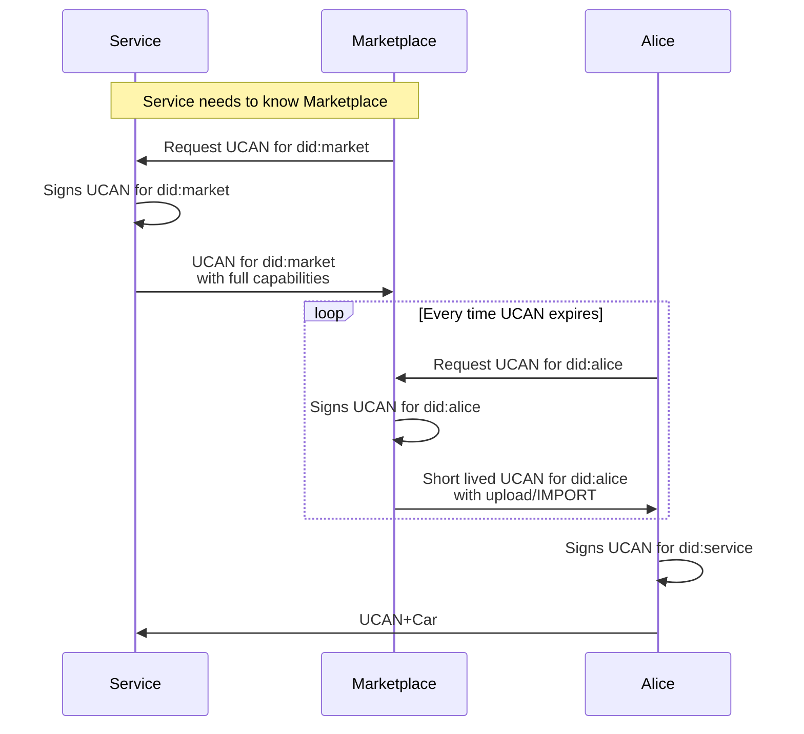
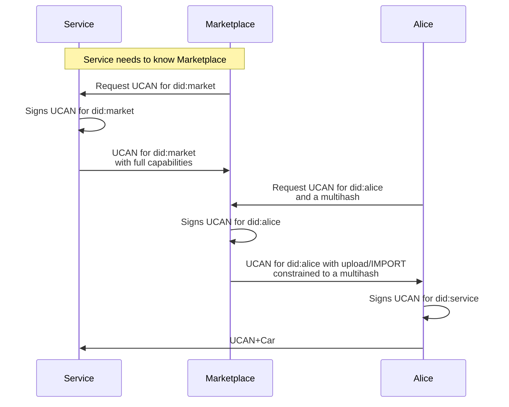

# DRAFT UCAN.storage Specification v0.0.1

## Authors

- [Hugo Dias](https://github.com/hugomrdias)
- [Irakli Gozalishvili](https://github.com/Gozala)

# 0. Abstract

UCAN.storage defines the [UCAN](https://github.com/ucan-wg/spec/blob/main/README.md) protocol used by [web3.storage](web3.storage) and [nft.storage](nft.storage). It inherits all the UCAN characteristics by just defining a specific set of [capabilities](https://en.wikipedia.org/wiki/Object-capability_model) and [facts](https://github.com/ucan-wg/spec/blob/main/README.md#324-facts).

## Language

The key words "MUST", "MUST NOT", "REQUIRED", "SHALL", "SHALL NOT", "SHOULD", "SHOULD NOT", "RECOMMENDED", "MAY", and "OPTIONAL" in this document are to be interpreted as described in [RFC 2119](https://datatracker.ietf.org/doc/html/rfc2119).

# 1. Introduction

UCAN.storage describes how our services leverage UCANs to decentralized authorization and access permissions using a specific capability scheme embedded in UCAN tokens.

The rest of this document outlines the `storage` scheme, the capabilities it supports and considerations that implementers might want to be aware of when implementing.

# 2. Terminology

Refer to [UCAN Spec](https://github.com/ucan-wg/spec/blob/main/README.md#2-terminology) for general UCAN terminology. This document defines only term specific for UCAN.storage.

# 2.1 Service

A service is an entity that implements this spec, is able to serve as root issuer of UCAN.storage tokens and validate them. Examples of UCAN.storage complaint services are [web3.storage](https://web3.storage) and [nft.storage](https://nft.storage).

# 2.2 DID

DIDs in this document use the [`did:key` method](https://w3c-ccg.github.io/did-method-key/) and may be referred to as `did:user1`, `did:service` for simplicity in examples and descriptions.

The actual representation is always as described in the `did:key` [specification](https://w3c-ccg.github.io/did-method-key/#format).

```abnf
did-key-format := did:key:<mb-value>
mb-value       := z[a-km-zA-HJ-NP-Z1-9]+
```

# 3. JWT Structure

The JWT header and payload structure in this document serves just a visual reference, the overall container remains the same as in the [UCAN spec](https://github.com/ucan-wg/spec/blob/main/README.md#3-jwt-structure). For UCAN.storage this document defines just the structure of the `att` claims.

## 3.1 Header

The header MUST include all of the following fields:
| Field | Type | Description | Required |
|-------|----------|--------------------------------|----------|
| `alg` | `String` | Signature algorithm | Yes |
| `typ` | `String` | Type (MUST be `"JWT"`) | Yes |
| `ucv` | `String` | UCAN Semantic Version (v2.0.0) | Yes |

## 3.2 Payload

The payload MUST describe the authorization claims being made, who is involved, and its validity period.

| Field | Type       | Description                                      | Required |
| ----- | ---------- | ------------------------------------------------ | -------- |
| `iss` | `String`   | Issuer DID (sender)                              | Yes      |
| `aud` | `String`   | Audience DID (receiver)                          | Yes      |
| `nbf` | `Number`   | Not Before UTC Unix Timestamp (valid from)       | No       |
| `exp` | `Number`   | Expiration UTC Unix Timestamp (valid until)      | Yes      |
| `nnc` | `String`   | Nonce                                            | No       |
| `fct` | `Json[]`   | Facts (asserted, signed data)                    | No       |
| `prf` | `String[]` | Proof of delegation (witnesses are nested UCANs) | Yes      |
| `att` | `Json[]`   | Attenuations                                     | Yes      |

### 3.2.2 Attenuation

The REQUIRED `att` field contains a set of capabilities as defined in the [Capability Scope](https://github.com/ucan-wg/spec#24-capability-scope).

For UCAN.storage `att` MUST contain at least one `storage` capability.

#### Examples

```json
"att": [
  {
    "with": "storage://<did_aud>/<did_aud>",
    "can": "upload/IMPORT",
  }
]
```

# 4. `storage` Capability

The `storage` capability represents the ownership and access to operations over storage resources in a [Service](#21-Service).

## 4.1 Resource Pointer

The resource pointer MUST match the current proof scope. Meaning it will follow the UCAN chain of audiences.

When a [Service](#21-Service) issues a UCAN for `did:user1` the resource will be `storage://did:user-1`, if `user-1` issues a delegated UCAN to `did:user-2` it MAY further restrict the scope of it by setting the resource to `storage://did:user-1/did:user-2/`.

When restricting the issuer MUST add another path segment to the resource URI. Using audience DID will guarantee uniqueness, although it is not REQUIRED to be unique and could be anything i.e. `storage://did:user-1/public`.

<!--
> We avoid name collisions simply by treating `/` terminated paths as directories and non `/` terminated as files.
-->

#### Examples

```json
// Ucan from service to user1

{
    "iss": "did:service"
    "aud": "did:user-1"
    "att": {
        "with": "storage://did:user-1"
    }
}

// Ucan from user1 to user2

{
    "iss": "did:user-1"
    "aud": "did:user-2"
    "att": {
        "with": "storage://did:user-1/did:user-2"
    }
}

// Ucan from user2 to service

{
    "iss": "did:user2"
    "aud": "did:service-did"
    "att": {
        "with": "storage://did:user-1/did:user-2"
    }
}

```

## 4.2 Actions

### 4.2.1 Upload with all operations `upload/*`

The `upload/*` action allows access to **ALL** upload operations under the specified resource in the `with` field.

```json
"att": [
  {
    "with": "storage://did:user",
    "can": "upload/IMPORT",
  }
]

```

### 4.2.2 Upload with import operation `upload/IMPORT`

The `upload/IMPORT` action allows access to importing a CARs under the specified resource in the `with` field.

```json
"att": [
  {
    "with": "storage://did:user",
    "can": "upload/IMPORT",
  }
]

```

#### 4.2.2.1 `upload/IMPORT` Constraints

The `upload/IMPORT` action MUST support a OPTIONAL field `mh` to constrain an import by [multihash](https://github.com/multiformats/multihash).

> A Service MAY use this multihash to perform integrity check.

```json
"att": [
  {
    "with": "storage://did:user",
    "can": "upload/IMPORT",
    "mh": "CIQJZPAHYP4ZC4SYG2R2UKSYDSRAFEMYVJBAXHMZXQHBGHM7HYWL4RY"
  }
]

```

# 5. User Stories

### Marketplace intermediary

Marketplace issues delegated restricted tokens to their users.

#### Access control

To limit to single upload session market can issue UCAN for DID for the session with short lifespan. Client app may perform multiple CAR uploads for that specific DID and throw the key once complete.

If UCAN expires user can request another UCAN to extend the session can be issued by marketplace.

This way maketplace can track specific uploads by DIDs.

further can limit by requesting upload specific UCANs and throw them away once upload is done.

- expiry
- upload session DIDs



```json
// UCAN for did:market
{
  "iss": "did:service",
  "aud": "did:marketplace",
  "exp": 1643905307, // 2 years into the future
  "att": {
    {
      "with": "storage://did:marketplace",
      "can": "upload_v1/*"
    }
  }
}

// UCAN for did:alice
{
  "iss": "did:marketplace",
  "aud": "did:alice",
  "exp": 1643905307, // 15 mins into the future
  "att": {
    {
      "with": "storage://did:marketplace/did:alice",
      "can": "upload_v1/IMPORT"
    }
  }
}

// UCAN for did:service
{
  "iss": "did:alice",
  "aud": "did:service",
  "exp": 1643905306, // =< 15 mins
  // call we skip this att since it can't be anything other than the previous ????
  "att": {
    {
      "with": "storage://did:marketplace/did:user", // "with": "prf:*"
      "can": "upload_v1/IMPORT"                     // "can": "ucan/DELEGATE"
    },
  },
  "prf": [
      ucan_0
  ]
}
```

### Marketplace intermidiates every upload by multihash



```json
// UCAN for did:market
{
  "iss": "did:service",
  "aud": "did:marketplace",
  "exp": 1643905307, // 2 years into the future
  "att": {
    {
      "with": "storage://did:marketplace",
      "can": "upload_v1/*"
    }
  }
}

// UCAN for did:alice
{
  "iss": "did:marketplace",
  "aud": "did:alice",
  "att": {
    {
      "with": "storage://did:marketplace/did:user",
      "can": "upload_v1/IMPORT",
      "mh": "CIQJZPAHYP4ZC4SYG2R2UKSYDSRAFEMYVJBAXHMZXQHBGHM7HYWL4RY"
    },
  }
}

// UCAN for did:service
{
  "iss": "did:user",
  "aud": "did:service",
  // call we skip this att since it can't be anything other than the previous ????
  "att": {
    {
      "with": "storage://did:marketplace/did:user",
      "can": "upload_v1/IMPORT"
    },
  }
}
```
